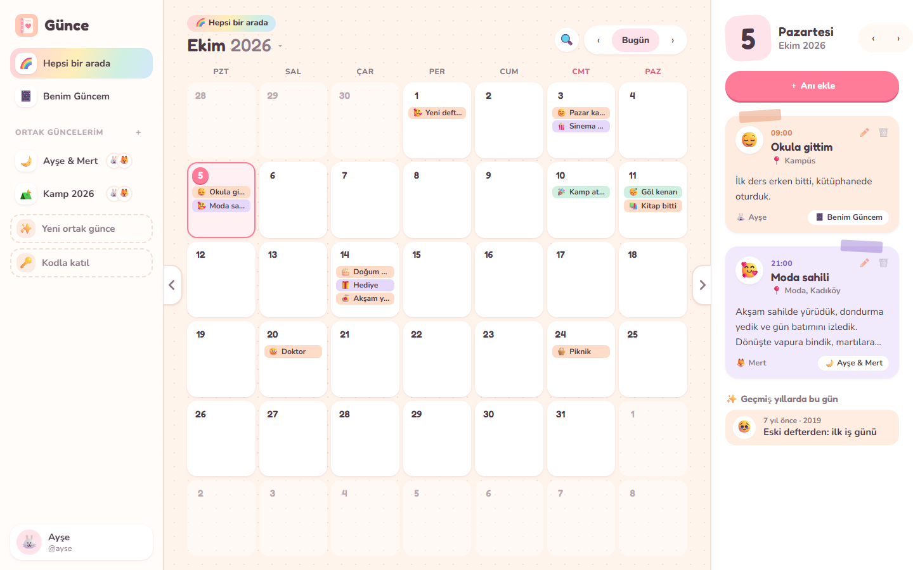
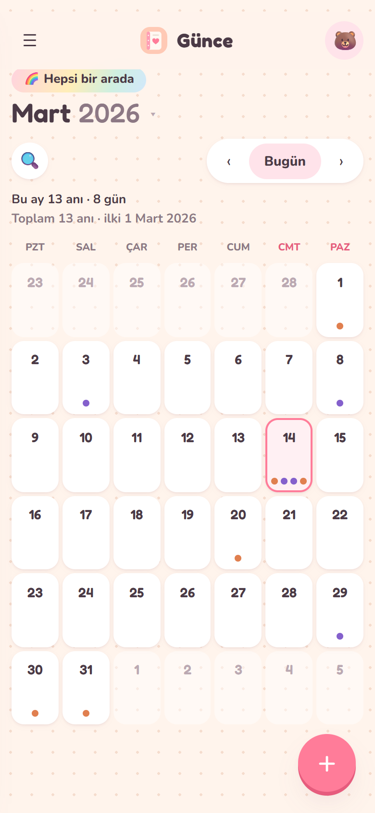
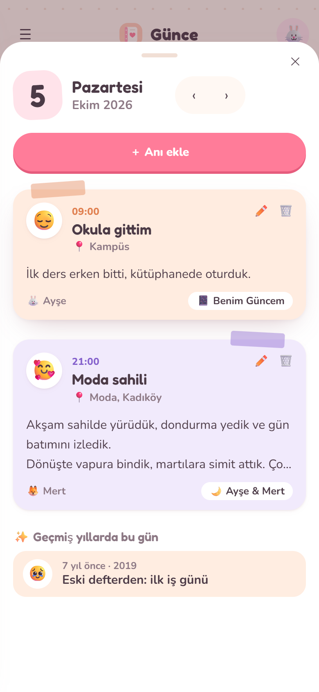
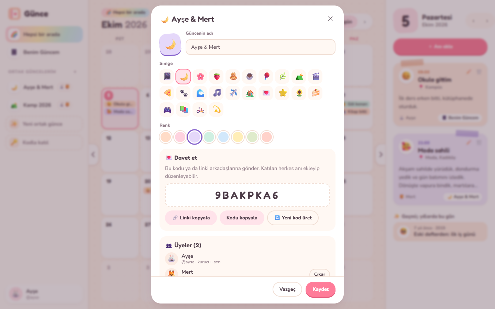
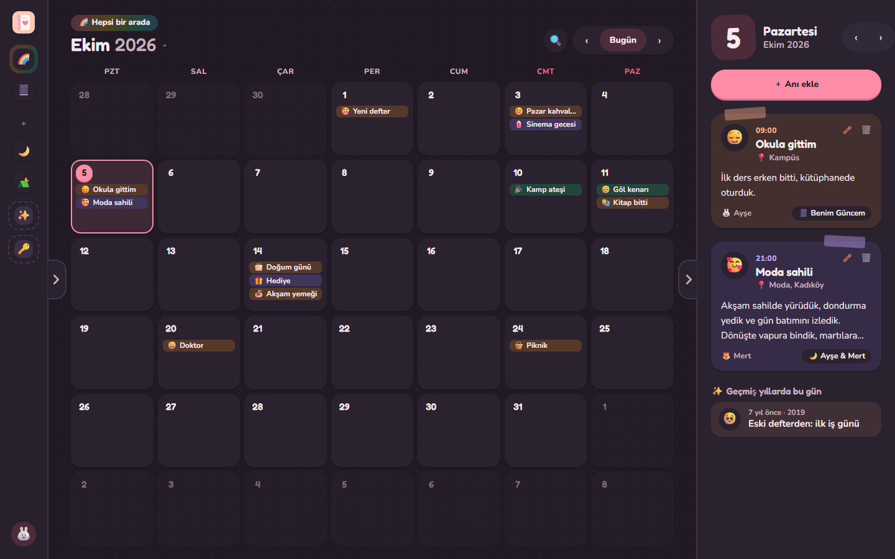

# 📔 Günce

**A cozy journal you can keep alone or together.**

*Günce* is an old Turkish word for "diary". Everyone gets one personal journal, and you can start as many shared journals as you like with friends, partners or family. Write about your morning in your own journal, then write about tonight's dinner in the journal you share with the friends you went with. Every member of a shared journal can add, edit and delete its memories.

Everything sits on a monthly calendar. Click a day to read or write. There is no year limit, so if you've kept paper diaries since 2009 you can go back and type them in.

> 🤖 **This project was vibe coded.** It was built by describing the idea in plain language to an AI coding assistant (Claude Code) and iterating on the result. A person reviewed and tested it, but no one wrote it line by line. Read the code before you rely on it for anything important.

<p align="center">
  
</p>

<p align="center">
  
  &nbsp;
  
</p>

## Features

- **One personal journal per person.** It's created when you sign up and only you can see it.
- **Unlimited shared journals.** Give one a name, an emoji and a colour, then invite people with an 8-character code or a link (`/join/CODE`). Every member can write, edit and delete entries. The owner can remove members or generate a new code, which stops the old one from working.
- **Monthly calendar that never scrolls.** Every month is drawn as the same six-week grid, sized to fit the screen. Each day shows coloured chips for its memories, as many as fit, plus a "+N" badge for the rest (dots on phones). The "Everything together" view merges all your journals, coloured by journal.
- **Flexible layout.** Tabs on the panel edges collapse the sidebar to an emoji rail and hide or show the day panel. The app remembers your choice.
- **Tidy day panel.** Memories appear as short cards (title, place and a 3-line excerpt). Click one to read the whole thing in the middle of the screen, where you can also edit or delete it.
- **Any year from 1 to 9999.** Jump to any month or year from the picker. Dates are handled as plain strings, so 1987 behaves exactly like 2026.
- **Rich entries.** Each entry has an optional time, a mood emoji, a title, an optional place and free text. Shared entries show who wrote them and who last edited them. Entries can be moved to another journal.
- **On this day.** The day panel lists what you wrote on the same date in other years.
- **Search** across titles, text and places.
- **JSON backup** of any journal.
- **Turkish and English**, plus light, dark and automatic themes.
- **Works on phones.** The calendar collapses to dots and days open as a bottom sheet. You can add it to your home screen (web manifest).
- **Keyboard shortcuts:** `←` `→` change month, `N` new memory, `/` search, `T` today, `[` toggle sidebar, `]` toggle day panel.
- **Live-ish sync.** Open tabs quietly refresh every 45 seconds and whenever you come back to the tab, so you see what friends added.

<p align="center">
  
  &nbsp;
  
</p>


## Tech

Kept small on purpose:

| Part | Choice |
| --- | --- |
| Server | Node.js 20+, Express |
| Database | SQLite through `better-sqlite3`, stored in one file |
| Frontend | Plain HTML, CSS and ES modules. No framework and no build step |
| Auth | Username and password hashed with scrypt. Sessions are random tokens stored hashed, in an `HttpOnly` `SameSite=Lax` cookie |
| Tests | `node:test` API tests |

```
server/
  index.js     starts the HTTP server
  app.js       routes, validation, auth
  db.js        schema and connection
public/
  index.html   app shell
  app.js       the whole UI
  i18n.js      Turkish + English strings
  styles.css   design tokens, layout, light/dark themes
test/
  api.test.js
```

## Run it locally

```bash
git clone https://github.com/yavuzkrm/gunce.git
cd gunce
npm install
npm start          # http://localhost:3000
npm test           # API tests
```

The database is created at `./data/gunce.db`. Set `DATA_DIR` to store it somewhere else.

| Variable | Default | Meaning |
| --- | --- | --- |
| `PORT` | `3000` | HTTP port |
| `DATA_DIR` | `./data` | Folder that holds `gunce.db` |
| `DB_FILE` | – | Full path to the database file (overrides `DATA_DIR`) |
| `NODE_ENV` | – | Set to `production` to mark cookies `Secure` (HTTPS only) |

## Deploy

GitHub Pages only serves static files, and Günce needs a small server for accounts and shared journals. Any host that runs Node or Docker will work. Railway is the easiest:

### Railway

1. Push this repo to GitHub.
2. On [Railway](https://railway.com), go to **New Project → Deploy from GitHub repo** and pick it. The included `Dockerfile` and `railway.json` are used automatically.
3. **Add a volume** to the service and mount it at **`/data`**. Without a volume, every deploy wipes the database.
4. Under **Settings → Networking**, click **Generate Domain**.

That's it. The Docker image already sets `NODE_ENV=production` and `DATA_DIR=/data`, and Railway's health check uses `/api/health`.

> SQLite lives on one disk, so run a **single replica**. That's plenty for friends and family.

### Docker anywhere

```bash
docker build -t gunce .
docker run -p 3000:3000 -v gunce-data:/data gunce
```

The image runs with `NODE_ENV=production`, so the session cookie needs HTTPS. To try it over plain `http://localhost`, add `-e NODE_ENV=development`.

### Backups

Everything is in one file: `/data/gunce.db`, plus `-wal`/`-shm` files while the app is running. Copy it while the app is stopped, or use `sqlite3 gunce.db ".backup backup.db"`. Users can also download each journal as JSON from its settings.

## API

All endpoints are under `/api`, and request and response bodies are JSON. Requests that change data must send `Content-Type: application/json`. Together with the `SameSite` cookie, this blocks cross-site form posts (CSRF).

| Method | Path | |
| --- | --- | --- |
| POST | `/auth/register` · `/auth/login` · `/auth/logout` | |
| GET / PATCH / DELETE | `/me` | profile, password change, account deletion |
| GET / POST | `/journals` | list journals / create a shared one |
| PATCH / DELETE | `/journals/:id` | edit / delete (owner) |
| POST | `/journals/:id/invite` | new invite code (owner) |
| POST | `/journals/:id/leave` | leave; ownership passes to the longest-standing member |
| DELETE | `/journals/:id/members/:userId` | remove member (owner) |
| POST | `/join` | `{ code }` |
| GET | `/journals/:id/export` | JSON backup |
| GET | `/entries?journal=all\|ID&from=YYYY-MM-DD&to=YYYY-MM-DD` | entries in a range |
| GET | `/entries/search?q=` · `/entries/memories?date=` · `/stats` | |
| POST | `/journals/:id/entries` | new entry |
| PATCH / DELETE | `/entries/:id` | edit (can move to another journal) / delete |

## Privacy notes

- Passwords are never stored in plain text (scrypt with a per-user salt).
- Only members of a journal can read it. Personal journals are visible only to their owner.
- When you delete your account, your personal journal is deleted. Shared journals you own pass to the member who joined earliest, or are deleted if you were the only member. Entries you wrote in shared journals stay there, shown as "Former member".
- There is no email and no password reset yet. If you forget your password, the server admin has to help.

## Ideas for later

Photos on entries, reactions and comments, email-based password reset, real-time updates over WebSockets, and importing from other diary apps.

## License

[MIT](LICENSE)
